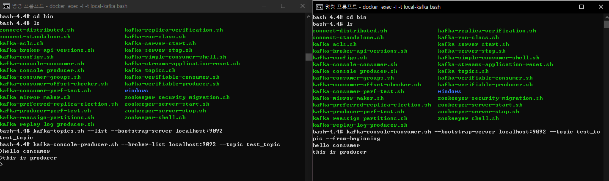
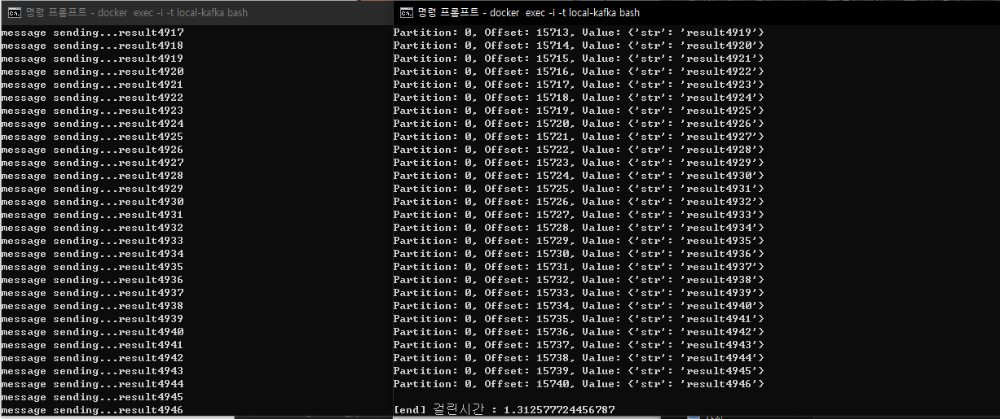
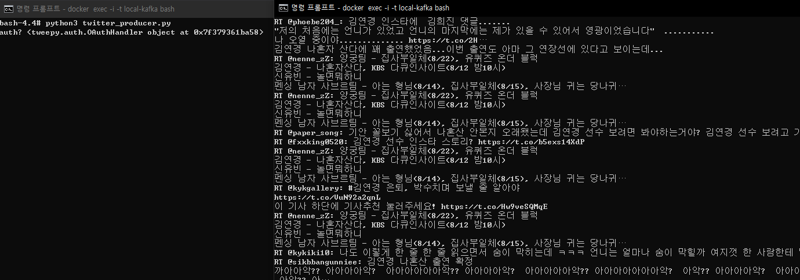

<h2>Kafka 학습공간</h2>

<h3>Docker로 Kafka 구축</h3>

카프카 클러스터와 주키퍼를 설치하기 위해 docker-compose 사용 

- docker-copose.yml 작성

- 실행 : docker-compose -f docker-compse.yml up -d
- 컨테이너(카프카) 접속 : docker exec -i -t local-kafka bash 

 ### [Kafka 메세지 전송하기](https://pearlluck.tistory.com/638?category=935063)

- kafka install : wget 경로이슈로 직접 다운로드한 kafka_2.12-0.10.2.0.tgz 사용
- topic 생성 : bin/kafka-topics.sh --create --bootstrap-server localhost:9092 --replication-factor 1 --partitions 1 --topic test_topic
- topic 확인 : bin/kafka-topics.sh --list --bootstrap-server localhost:9092
- producer 시작 :  bin/kafka-console-producer.sh --broker-list localhost:9092 --topic test_topic
- consumer 시작 :  bin/kafka-console-consumer.sh --bootstrap-server localhost:9092 --topic test_topic --from-beginning
- 메세지전송 확인 : 직접 입력한 메세지가 Producer에서 Consumer로 전송
  
  

### [Python으로 Producer/Consumer 구현하기](https://pearlluck.tistory.com/639?category=935063)

- Producer 구현 : 1부터 10000까지 문자열 전송 (data = {'str' : 'result'+str(i)} )
- Consumer 구현 : 연속적인 메세지를 받아옴 (message.value)
- Producer 시작 : python3 producer.py
- Consumer 시작 :  python3 consumer.py
- 메세지전송 확인 : 연속적인 메세지가 Producer에서 Consumer로 전송 (topic: topic_test)

  
  
### [Twitter 실시간데이터를 Kafka로 전송하기](https://pearlluck.tistory.com/640?category=935063)

- Producer 구현 : twitter API를 사용하여 raw_data['text']를 kafka의 topic으로 스트림전송
- Producer 시작 : python3 twitter_producer.py
- Consumser 시작 : bin/kafka-console-consumer.sh --bootstrap-server localhost:9092 --topic twitter_topic --from-beginning
- 메시지전송 확인 : '김연경'으로 필터링한 트위터 데이터가 실시간으로 전송 (topic: twitter_topic)

  
